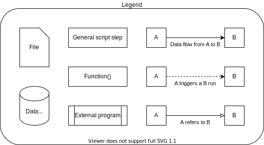
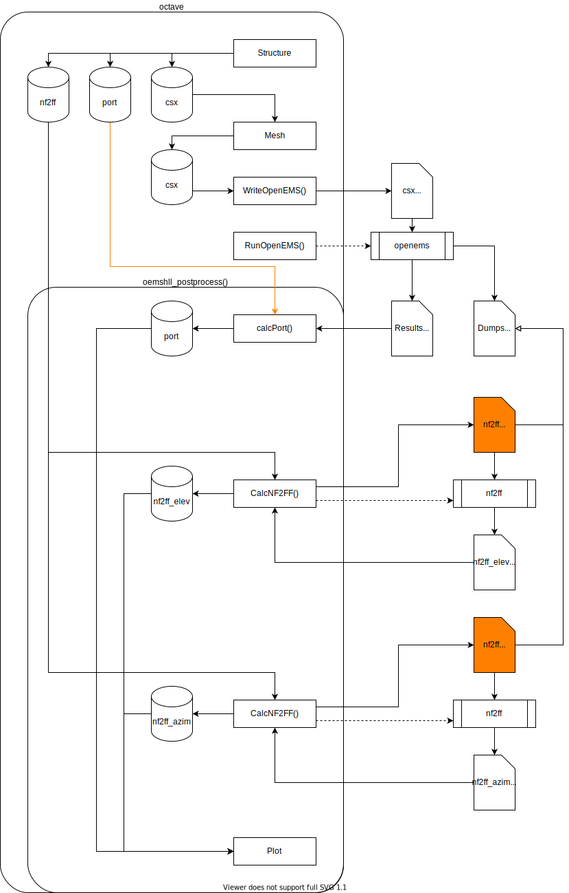
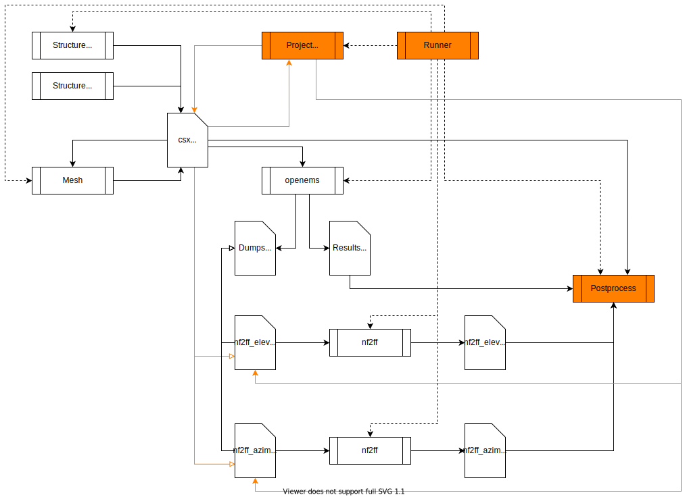
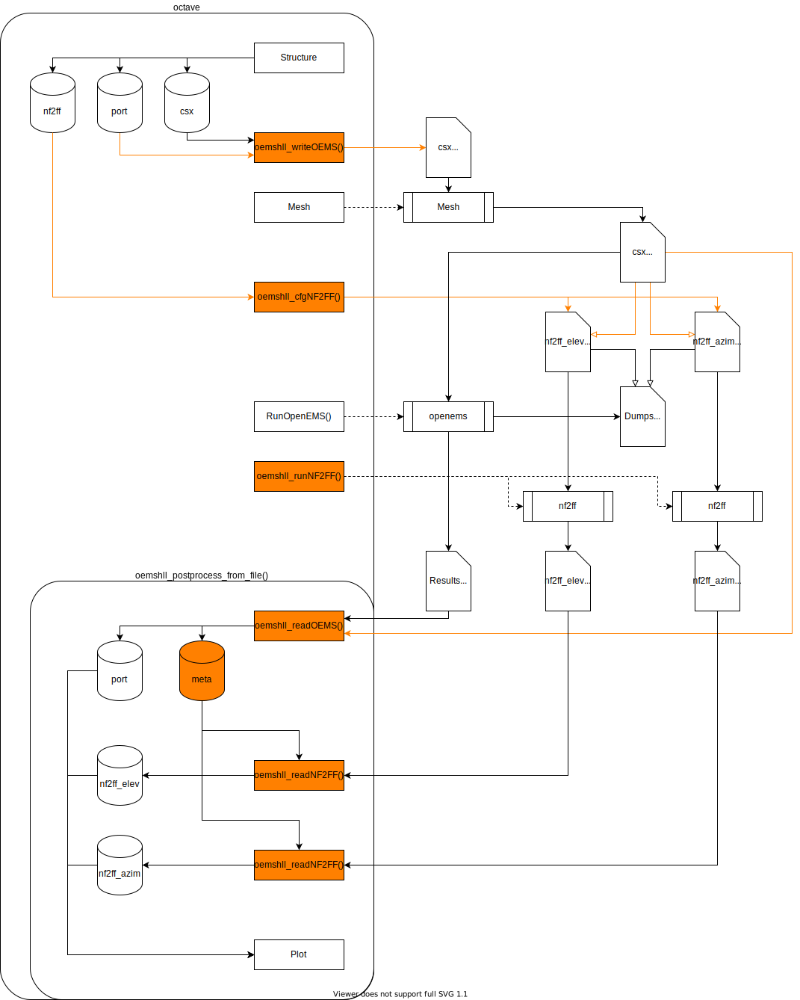

# OpenEMS rework proposition

## Abstract

I'd like [OpenEMS](https://openems.de) to be usable without an Octave or Python API, but instead like a suite of tools that do what they meant and share data using files, just like projects like KiCad or gEDA do.

But it worth mentioning I don't want this workflow to replace the legacy one but both to **coexist** and moreover, to be **compatible**.

I think an extension of the XML file format used by OpenEMS would lead to this situation.

### Current state

Some information like a the port metaconstruction (resistance + excitation + probeboxes) are defined in the octave API and are necessary to be known to correctly postprocess results. So for one that want to perform postprocessing, there are only two roads :
- Using Octave as postprocessor.
- Replacing Octave by a program that wrap the whole simulation process. Some programs that _integrate_ OpenEMS like QucsStudio took this road, pcb-rnd also aims to rework its export interface this way.

### Problem

The problem with that is all the different integrations would be difficultly compatible with each other and with the script APIs. Moreover the fact **porting** the Octave API features to something else is the only way not to use Octave is in itself a bad thing.

Having scripts as main interface has advantages (and is indeed one of the main reasons of OpenEMS success IMHO) but has also serious drawbacks in term of :
- UX especially for non developers
- interoperability of simulation projects
- integration with the rest of the electronic engineering software stack (Qucs, KiCad, FreeCAD, etc.)

### Proposition

The whole reorganization of the OpenEMS suite would rely on a simple modification of the `csx.xml` file (in fact rather an addition of a paragraph), that would become more like a `project.xml`
In a first time a software designated as "project manager" would let you edit all the new fields of the XML file, then AppCSXCAD and 3rd party converters could be slightly modified to natively generate certain fields while generating the file.

An other tool would be the "runner", that would ease the interaction of the different software of the suite (AppCSXCAD, mesher, OpenEMS, NF2FF, postprocessor), just like the KiCad application does nothing more than letting you switching between Eeschema, PcbNew, GerbView, etc.
Using this tool would of course not be mandatory to use OpenEMS.

**Note:** Support for this file format extension will probably be implemented in the Octave API first (through [octave-openems-hll](https://github.com/Open-RFlab/octave-openems-hll) in a first time).

### Benefits

The big advantage of this enhancement of the file format would be the total decoupling of the different tools of the suite, thus a postprocessor could be totally interchangeable with another, the same with meshers and so on.
Adoption of this file format would immediately make different integrations of OpenEMS (dedicated to different purpose) compatible with each other. For example if a team conceive a board and perform signal integrity in their engineering workflow, and a 3rd party take a look to the project and wants to observe the far field radiations of the board, it would just be about using a different postprocessor, not about spending hours to adapt a script.

Also the addition of a new paragraph to the file format would be totally backward compatible and would not break the current script based workflows.

## Architecture overview

<p align="center">
  
</p>

Here are three schematics of the OpenEMS workflow, considering the legend above. (Drawio editable svg)

<p align="center">
  
</p>

This is how OpenEMS currently works (considering an [octave-openems-hll](https://github.com/Open-RFlab/octave-openems-hll) based script that is quite canonical in term of decoupling steps and of postprocessing capabilities).

In orange are the problematic parts :
- The port knowledge input of the postprocessor that comes from inside the script instead of the file.
- The `nf2ff.xml` that has an unique immutable name and is overwritten each time we run a different far field computation. The unique name is how the association between CSX and NF2FF file is currently done.



That is how the tool suite could interact without being driven by an Octave script, based on the XML file format extension proposed here.

In orange are the crucial parts :
- The runner that triggers every other executable (except a 3rd party converter of course).
- The project manager that would propose an editing interface to the `csx.xml`' new paragraph. And then that would generate the different `nf2ff_<>.xml` based on the user NF2FF configuration (those NF2FF XML files would be known by the `csx.xml` file).
- The postprocessor would read the `csx.xml` file and would _just know_ which data files and how to read them to perform postprocessing.



Alternatively, this is an Octave workflow based on a reworked API that would be compatible with proposed file format extension and thus the previous workflow.

In Orange are the crucial parts :
- The informations about port metaconstructions would have to be dumped to the `csx.xml` file at the same time as the regular informations.
- The current `CalcNF2FF()` Octave function would have to be splitted into 3 new functions
  - One that writes the `nf2ff_<>.xml` file.
  - One that runs NF2FF.
  - One that reads the NF2FF results.

## File format draft

Here is a draft of the XML file extension :

```xml
<?xml version="1.0" encoding="UTF-8" standalone="yes" ?>
<openEMS>
<!--
  <FDTD>
  </FDTD>
  <ContinuousStructure>
  </ContinuousStructure>
-->
  <Meta>
    <Port Number="1" Excitation="port_excite_1" Resistance="port_resist_1" ProbeUt="port_ut1" ProbeIt="port_it1">
      <!--
        Should be generated directly by AppCSXCAD or converters, must be
        editable by project manager while not everything support the feature.
      -->
    </Port>
    <Mesh Number="1" File="csx.oemsh" Active="1">
      <!--
        To access the file that contains mesh generation directives and enable
        user to rework on mesh, regenerate it, and update CSX part of this file.
        Could lead to easy possibility to associate multiple meshs to a CSX
        structure and switch between thoose.
        Field generated by oemsh itself or project manager.
      -->
    </Mesh>
  </Meta>
  <PostProcessing>
    <NF2FF Name="Azimuth" File="nf2ff_azim.xml">
    </NF2FF>
    <!--
      Generated by the "postprocessing configuration" part of the project
      manager. Could be part of the Meta paragraph?
    -->
  </PostProcessing>
</openEMS>
```

## Modifications to do

- Automatic mesher : Cf. [OpenEMSH project](https://github.com/Open-RFlab/openemsh)
- CSX XML file : Metadata paragraph (ports, NF2FF dump boxes, etc.)
- CSX XML file : Postprocessing paragraph (NF2FF XML files, wanted datas)
- Octave `CalcNF2FF()` : Support arbitrary file name & store correspondance in CSX file
- Octave `WriteOpenEMS()` : Also dump port structure
- Octave `oemshll_postprocess_from_file()`
- AppCSXCAD / QCSXCAD : Metastructures creation (ports, NF2FF dump boxes, etc.)
- AppCSXCAD / QCSXCAD : NF2FF management (XML file creation, angles visualisation)
- NF2FF XML file : Support frequencies & angles ranges (like `[beg : step : end]`)
- CLI for all OpenEMS tools (runner)
- Postprocessor : Porting octave-openems-hll to Python as a standalone tool
- Project manager : Basically an editor of the new XML paragraph
